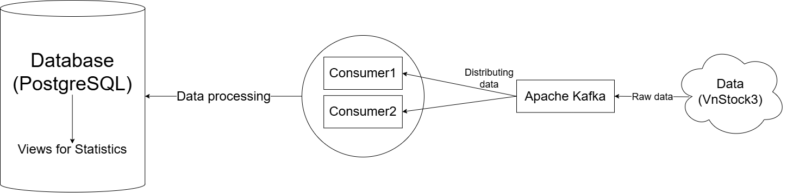
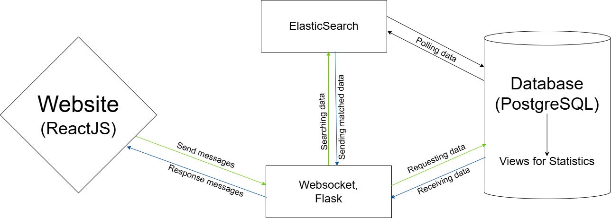
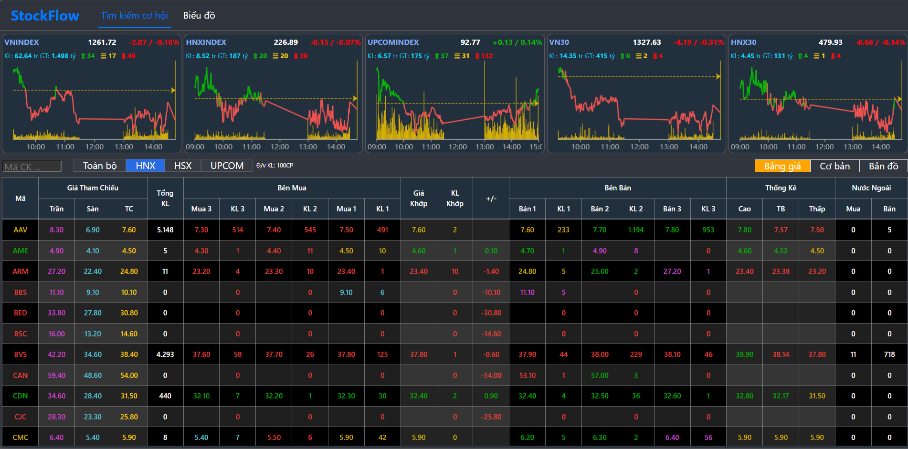
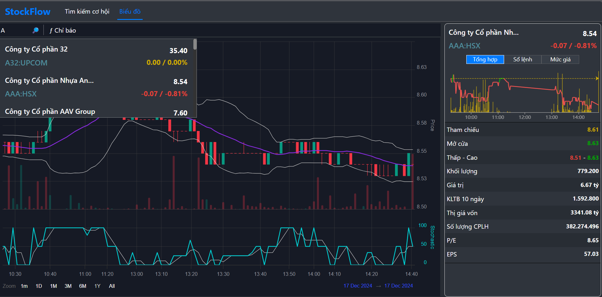

# System Workflow

The web system provides real-time stock data through three main components:

- Back-end: Data retrieval, processing, and storage
- Front-end: User interface
- API: Front-end and back-end communication

## 1. Back-end

**Data Source:** Real-time stock data from VNStock3

**Data Processing:** Raw data flows through Apache Kafka for distribution to consumers, processing, and database insertion

**Data Storage:** Processed data stored in PostgreSQL with optimized views for statistics and queries

## 2. API

**Real-Time Data Requests (WebSocket and Flask)**

- Program uses WebSocket/Flask API for real-time data requests
- Flask handles requests, queries PostgreSQL, returns results via WebSocket

**Data Search (ElasticSearch)**

- Front-end search requests processed through ElasticSearch API
- PostgreSQL data syncs to ElasticSearch via polling

## 3. Front-end

Built with ReactJS and frameworks for an interactive, responsive UI. Communicates with back-end for:

- Real-time stock data retrieval and display
- Search functionality
- Stock analysis and visualization

# Program demonstration

My website contains two main pages: "Tìm kiếm cơ hội" (Opportunity Search) and "Biểu đồ" (Charts).

## 1. Opportunity Search

**Function:** Looking for likely investments in the share market based on:

- Stock price growth and market conditions
- Financial indicators of the company

**Purpose:** Helps investors select good opportunities by sorting and evaluating market information.

## 2. Charts

**Function:** Provides graphical analysis tools including:

- Stock price graphs (minute, daily, monthly)
- Technical indicators (Moving averages, RSI, MACD)
- Detailed company data with prices and volumes

**Purpose:** Assists investors in identifying patterns, market fluctuations, and technical factors for better investment decisions. Helps observe trends and forecast price movements.
